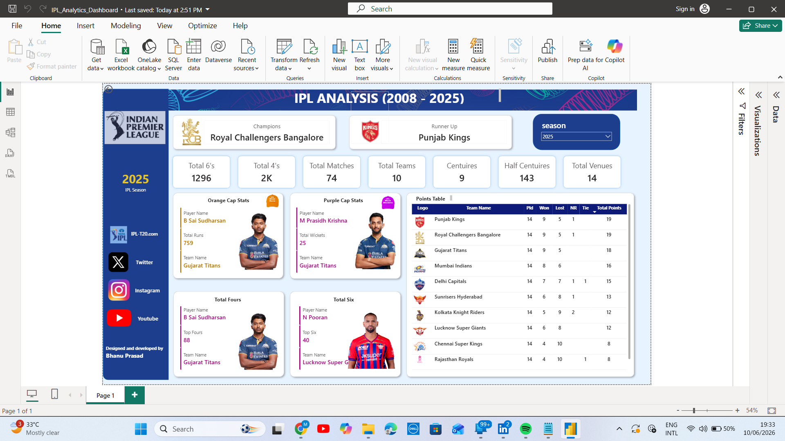
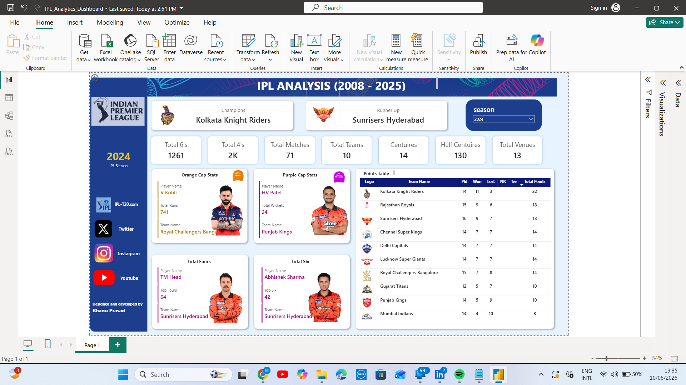

 #### IPL End-to-End Analytics
 ### Project Overview

The IPL End-to-End Analytics Project is a comprehensive Data Analytics project that explores Indian Premier League (IPL) data using Power BI, MySQL, and Python. The project demonstrates the complete analytics workflow, from data cleaning and exploration to interactive dashboards and business insights.

 ## This project was built to strengthen practical skills in:

 * Data Cleaning
 * SQL Querying
 * Exploratory Data Analysis (EDA)
 * Data Visualization
 * Dashboard Development
 * Business Intelligence
 
 ### Project Objectives
 
 * Analyze IPL matches and ball-by-ball data.
 * Identify top-performing teams and players.
 * Explore batting and bowling trends.
 * Study toss decisions and match outcomes.
 * Understand venue and city-wise IPL performance.
 * Create interactive dashboards and business insights.

## 📸 Dashboard Preview

### Dashboard Page 1

### Dashboard Page 2

 
 ## Tools & Technologies
 
Tool                  Purpose
Python                Data Cleaning & EDA
MySQL                 Data Analysis & Business Queries
Power BI              Dashboard Creation
Pandas	              Data Manipulation
Matplotlib	          Data Visualization
Google Colab	        Python Development

 ### Dataset
 
The project uses four datasets:

 ## IPL Matches

Contains match-level information:

 * Match ID
 * Season
 * Teams
 * Venue
 * Toss Winner
 * Match Winner
 * Player of the Match
 * Result
 * Stage
 
 ## Ball-by-Ball Data

Contains delivery-level information:

 * Batter
 * Bowler
 * Runs
 * Extras
 * Wickets
 * Innings
 * Over and Ball Number

  ## Players Data

Contains player details.

 ## Teams Data

Contains team information.

 ## Power BI Dashboard

The interactive dashboard provides insights into:

 ## Match Analysis

 * Total Matches
 * Total Seasons
 * Total Teams
 * Season Winners

 ## Batting Analysis

 * Orange Cap
 * Most Sixes
 * Most Fours

 ## Bowling Analysis

 * Purple Cap
 * Wickets Analysis
 
 ## Team Analysis
 
 * Team Performance
 * Toss Impact
 * Venue Analysis
 
 ### MySQL Analysis

Business queries were written to analyze:

 ## Basic Analysis

 * Total Matches
 * Total Seasons
 * Total Teams
 * Most Successful Team
 * Popular Venues
 * Popular Cities

 ## Batting & Bowling

 * Orange Cap
 * Purple Cap
 * Most Sixes
 * Most Fours
 * Strike Rate
 * Economy Rate

 ## Team & Match

 * Team Wins
 * Toss Wins
 * Player of the Match
 * Match Stages
 
 ## Advanced Insights
 
 * Runs Per Season
 * Wickets Per Season
 * Dismissal Types
 * Team Performance
 
 ### Python Analysis

Python was used for:

 ## Data Cleaning

 * Handling missing values
 * Removing duplicates
 * Date conversion
 
 ## Exploratory Data Analysis

 * Match trends
 * Team performance
 * Batting analysis
 * Bowling analysis

 ## Visualizations

 * Bar charts
 * Pie charts
 * Season-wise trends
 * Team comparisons

 ### Key Insights

 ## Team Performance
 
 * Identified the most successful IPL franchises.
 * Compared toss wins and match wins.
   
 ## Batting
 
 * Top run scorers.
 * Players with the most boundaries.
 * Season-wise batting trends.

 ## Bowling
 
 * Highest wicket takers.
 * Economy rates.
 * Bowling performance across seasons.

 ## Venue Analysis

 * Most frequently used venues.
 * City-wise IPL distribution.

 ### Project Structure
 
IPL-End-to-End-Analytics
│
├── Dataset
│   ├── ball_by_ball_data.csv
│   ├── ipl_matches_data.csv
│   ├── players_data_updated.csv
│   └── teams_data.csv
│
├── MySQL
│   └── IPL_Analysis.sql
│
├── PowerBI
│   └── IPL_Dashboard.pbix
│
├── Python
│   └── IPL_Analytics.ipynb
│
├── Screenshots
│
└── README.md

 ### Skills Demonstrated

 ## SQL

 * GROUP BY
 * HAVING
 * JOIN
 * UNION
 * Aggregate Functions
 * Business Query Writing

 ## Python
 * Pandas
 * Data Cleaning
 * Exploratory Data Analysis
 * Data Visualization

 ## Power BI

 * Data Modeling
 * DAX Measures
 * Interactive Dashboards
 * KPI Development
 * Slicers and Filters

 ### Dashboard Preview

Add your Power BI dashboard screenshots in the Screenshots folder and include them here.

 ## Example:

Screenshots/
├── Dashboard_1.png
├── Dashboard_2.png

 ### Business Value

This project helps answer business questions such as:

 * Which teams have performed consistently over the years?
 * Does winning the toss significantly impact match outcomes?
 * Which venues host the most matches?
 * Who are the top-performing batters and bowlers?
 * How have IPL trends evolved across seasons?

 ### Learning Outcomes

Through this project, I gained hands-on experience in:

 * End-to-End Data Analytics
 * Data Cleaning and Preparation
 * SQL Business Querying
 * Python-based EDA
 * Interactive Dashboard Design
 * Data Storytelling

 ### Author
 
 Mamidala Bhanu Prasad
 Aspiring Data Analyst

 Hyderabad, India
 
 mamidala.bhanuprasad@gmail.com

 LinkedIn: https://linkedin.com/in/mamidala-bhanu-prasad

 GitHub: https://github.com/bhanu200405
